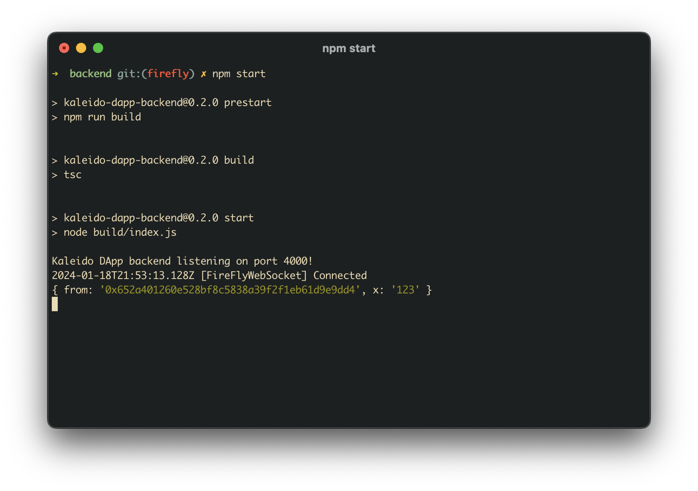
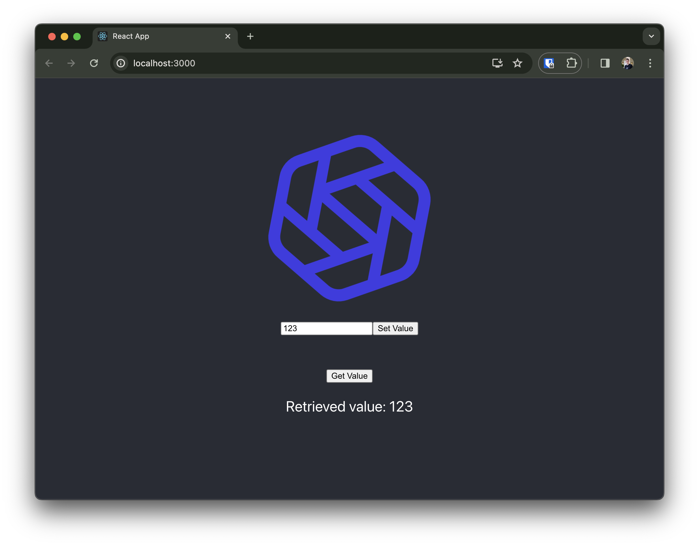

# Developer Challenge

Build a DApp on using FireFly.

Fork this repo, choose a use case you think would be interesting to build as a decentralized application (DApp), then get creative and have fun.

... and please **ask questions** - we don't want you to be stuck, and appreciate collaboration through the project.

## What is a DApp?

- [Ethereum Foundation](https://ethereum.org/en/developers/docs/dapps/)
  - Background of how DApps have evolved in the wild, and why
- [DApps Build on Ethereum](https://ethereum.org/en/dapps/)
  - All that's been built in the wonderful world of public Ethereum
- [FireFly docs](https://docs.kaleido.io/kaleido-platform/full-stack/dapps/)
  - DApps in an Enterprise context

## What does done look like?

We would like your project to demonstrate your concept end-to-end, but it doesn't need to be a complete application.

It must:

- Have a Web based frontend user experience which talks to your app's backend
- Have a backend-for-the-frontend (BFF), that uses FireFly's API
  - Note: An SDK including API wrappers and a WebSocket event listener is provided for Node.js and includes type definitions for TypeScript. You are not required to use it, but we strongly recommend it as it will save you a lot of time.
- Use Hyperledger FireFly
- Have on-chain Smart Contract logic, written in Solidity
- Contain a README that gives a quick overview of the use case, and tells us how to run it

How much time you spend on each tier is down to you - depending on your interests and the skills you want to show.

> We've given you a basic, but functional, starting point for each layer of the stack.
> ... and yes, we know the UI is a bit naff ;-)

## Some ideas

These are just ideas to give inspiration

Choose something/anything you think is interesting, and gives you license to focus on the bit of the stack you care about.

It's your choice whether you focus more on how things work under the covers, or how things feel in the UI/UX.

- A blockchain backed ratings system for Movies
- A racing simulation (you can even see one here in our [Racecourse sample](https://github.com/kaleido-io/racecourse))
- A funky avatar generator, where each avatar is backed by a unique token
- A conference ticketing system with camera & QR code integration
- A digital collectable swag bag, earned by posting to social media

## Want more dev stack?

Here are some dev technologies (not in the starter repo) that we love at Kaleido:

- TailwindCSS or Material UI (or insert your favorite component library here) - at Kaleido we love re-use
- GraphQL (Apollo) for front-end/back-end comms
- WebSockets for live updating and notifications
- PostgreSQL for relational data
- MongoDB NoSQL database for configuration and local state

Remember we'd like a thin thread through your DApp, so choose technologies you think you can be productive in.

Want to throw away most of the original `vite` + `express` based repo?
No problem. Go for it.

## Setting up your FireFly on your machine

1. Install the [FireFly CLI here](https://github.com/hyperledger/firefly-cli?tab=readme-ov-file#install-the-cli)
2. Create a FireFly stack by running:
   ```bash
   ff init devChallenge --block-period 2 # Please set this. We expect you to use 2 second block period for this project (as real world blockchains are not instantaneous)
   ```
3. Start the FireFly stack by running:
   ```bash
   ff start dev
   ```
4. When you're done, you will have FireFly and all its microservices, including your very own private blockchain, running on your machine.

If you run into issues, use the following resources to help:

1. [FireFly Getting Started Guide](https://hyperledger.github.io/firefly/latest/gettingstarted/firefly_cli/)
2. [FireFly CLI README](https://github.com/hyperledger/firefly-cli)
3. Ask the team in Whatsapp!

## Getting this repo up and running

This repo has three directories in it:

- `solidity`: Two example solidity contracts that can be compiled, tested, and deployed with Hardhat. [Go to the Readme](./solidity/)
- `backend`: A very simple TypeScript Node.js app that uses the FireFly SDK to interact with a custom smart contract. [Go to the Readme](./backen/)
- `frontend`: A TypeScript React UI bootstrapped with [vite](https://vitejs.dev/guide/) that calls the API in the backend. [Go to the Readme](./frontend/)

You will need to first deploy the example smart contracts with Hardhat to FireFly. Once the backend/frontend are started, the buttons on the Web UI will call the backend API endpoints to interact with the contracts through FireFly.




## Your journey begins here

Now it's your turn to build something! You can use this backend and frontend as a starting point for your app, or you can start from scratch if you want.

You will find the [FireFly documentation](https://hyperledger.github.io/firefly/latest/) useful as you build this project.
